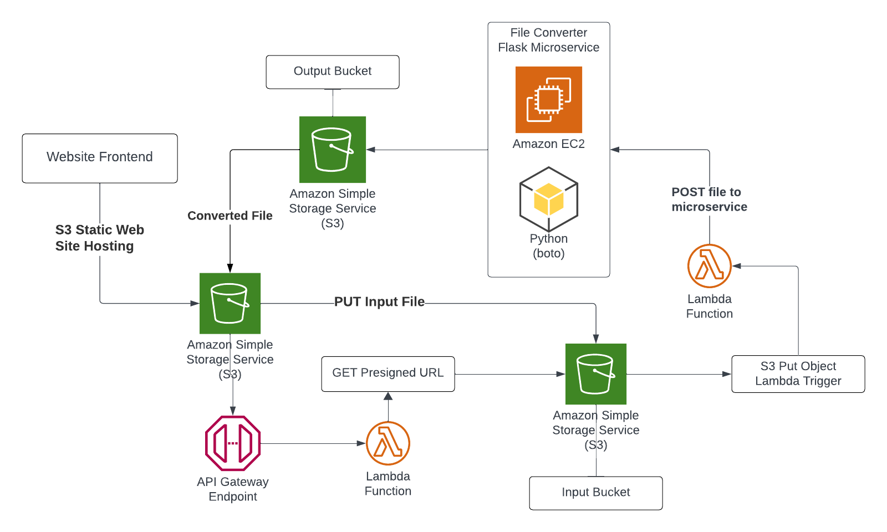

<h1 align="center">File Wizard</h1>

<p align="center">
  An open-source file conversion webapp built with NextJs, Python<br>
  and AWS for the HTTP API, Lambda functions and S3 object storage.<br>Converts .docx files to .pdf
</p>

<p align="center">
  <a href="#features"><strong>Features</strong></a> ·
  <a href="#running-locally"><strong>Running locally</strong></a> ·
  <a href="#overview"><strong>Overview</strong></a> ·
  <a href="#api-routing"><strong>API Routing</strong></a> ·
  <a href="#authors"><strong>Authors</strong></a>
</p>


## Features

- **Website**
  - [NextJs](https://nextjs.org) App Router
  - [Amazon Web Services](https://docs.aws.amazon.com/) for backend functionality
  - Support for `HTTP API`, `S3` File Storage, and `Lambda` functions
  - Edge runtime-ready
  
- **AWS Infrastructure**
  - [Amazon S3](https://aws.amazon.com/s3) Allows for object storage and static site hosting
  - [API Gateway](https://aws.amazon.com/eventbridge) hosts the HTTP API 
  - [AWS Lambda](https://aws.amazon.com/lambda) for processing JSON and filtering required data
  - [Amazon EC2](https://aws.amazon.com/sns) for provisioning VM instances 

### Tech Stack


## Overview


- A static site is hosted on `S3` with a document upload form. We use `API Gateway` to create an API which makes a `GET` request to a `Lambda` function after the user clicks <kbd>Upload File</kbd> on the form.

- The API sends a `presigned bucket URL` for the `uploads-bucket`. The site then automatically conducts a `PUT` request to the same bucket with the `.docx` file data.

- Another `Lambda` function is configured to listen for `PUT Object events` in the S3 `uploads-bucket`. It parses the event record for file name and sends a `POST` request to the Python `Flask App` performing the document conversion.

- An `EC2` instance is deployed with an Ubuntu OS image. A python script is setup to run as a background process.

- The python microservice converts documents using `pandoc` package and is exposed as an API using `Flask` listening for `POST` requests on a specified port.

- It downloads and saves the specified file with its ID, uploads the converted file to the `output-bucket` on `S3`. The static site returns the download link for the converted file from the `output-bucket`.

# Configuring application on AWS

## S3 Configuration (Only for using the static site as frontend)
The frontend of the app is hosted as a Static site in a separate S3 bucket.

> [!NOTE]
> To learn more about the `S3` static site and how to deploy it, visit the [`frontend/README.md`](./frontend/README.md)

## API Routing

The `HTTP API` is hosted on AWS using API Gateway and Lambda function which deploys a `getPresignedURL.js app`. Source code for lambda function is in the [`lambda/presignedURL.js`](./lambda/presignedURL.js)

> [!NOTE]
> To learn more about the `getPresignedURL.js app` and how to deploy it, visit the [`lambda/README.md`](./lambda/README.md) 

## Setup Flask Microservice in EC2 for PDF conversion

Create a `EC2 t2.micro` instance with an `Ubuntu Linux AMI` and note the VM's public IPv4 address.

#### Run the Flask development server within the VM:

### Installation

Before installing ensure its the correct Python version via `python -V`

```bash
sudo apt update && apt upgrade
sudo apt install pandoc texlive python3.10-venv
```

### Setup Python venv and script

```bash
python3 -m venv venv
source venv/bin/activate
pip install pypandoc boto3 flask
mkdir inputs outputs
touch app.py
```

Copy the contents of `app.py` within the python file by opening it with any code editor (nano, vim etc).

```bash
sudo su
nohup python3 app.py > log.txt 2>&1 &
```

- The Flask app should now be able to handle requests 24/7. It is being run as a background process using the `nohup` command to ensure application uptime as long as VM is running even if we were to exit out of remote shell.
- The logs and stdout along with stderr is saved to `log.txt` in the same directory.
- The `&` displays the process ID for the python process which may be recorded to perform `kill <PID>` in case the process is to be stopped.

The Flask app should now be running on:
[http://{ec2-instance-public-ipv4-address}:5000](http://{ec2-instance-public-ipv4-address}:5000/)

Replace this address in the API endpoint URL within the [trigger_converter.py](./lambda/trigger_converter.py) Lambda function to send the S3 `.docx` files to the Flask microservice to be converted.

> [!WARNING]
> This command only starts the webapp. You will need to configure the instance Security Group to allow TCP connections to port 5000 of the EC2 instance from any external IPv4 address [0.0.0.0/0] on AWS to get the full functionality.

> [!NOTE]
> Follow the above steps for the `PNG` and `CSV` converter microservices in similar fashion in separate directories and expose them on different ports.

## Usage

> [!Tip]
> In case webapp demo videos aren't loading below in the README, please visit [Youtube](https://www.youtube.com/watch?v=7NJh7KChyYo).

<p align="center"> 
  <video src= "https://github.com/SourasishBasu/File-Wizard/assets/89185962/405d58e0-a0a2-4aaf-9629-1145efe463bf" width="300"/>
</p>
<p align="center"><b> DOCX to PDF Conversion </b></p>
<br>
<p align="center"> 
  <video src= "https://github.com/SourasishBasu/File-Wizard/assets/89185962/a6b96fc3-22e8-4201-9425-932af09d0936" width="300"/>
</p>
<p align="center"><b> PNG to PDF Conversion </b></p>
<br>
<p align="center"> 
  
   <br><b>S3 uploads-bucket for .docx files</b>
</p>
<br>
<p align="center"> 
  
   <br><b>S3 output-bucket for .pdf files</b>
</p>
<br>
<p align="center"> 
  
   <br><b>Flask App process running in EC2</b>
</p>

## Authors

This project is created by [MLSA KIIT](https://mlsakiit.com) for Cloud Computing Domain's Project Wing:

- Sourasish Basu ([@SourasishBasu](https://github.com/SourasishBasu)) - [MLSA KIIT](https://mlsakiit.com)

## Version
| Version | Date          		| Comments        |
| ------- | ------------------- | --------------- |
| 1.0     | Jan 24th, 2024   | Initial release |

## Future Roadmap
**Website/API**
- [X] File Validation and Sanitization on server side
- [ ] Better PDF conversion engine to retain original formatting in higher quality
- [X] Better Error Handling
  
**AWS Infrastructure**
- [X] Actual implementation in production
- [X] Conversion feature between multiple file types
- [ ] Implementing image compression using methods such as Huffman Encoding

----
